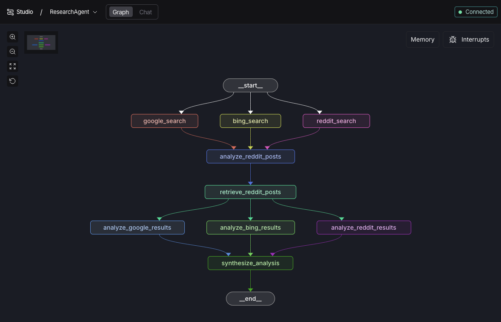

# Research Agent

A multi-source research agent built with LangGraph that searches Google, Bing, and Reddit to gather and synthesize information on any topic.



## Overview

This agent performs parallel web searches across multiple platforms, retrieves relevant Reddit discussions with comments, and uses an LLM to analyze and synthesize the findings into a comprehensive answer.

### How It Works

1. **Parallel Search** - Simultaneously searches Google, Bing, and Reddit for the user's query
2. **Reddit Deep Dive** - Analyzes Reddit search results and retrieves full post comments from relevant discussions
3. **Multi-Source Analysis** - Independently analyzes results from each source (Google, Bing, Reddit)
4. **Synthesis** - Combines all analyses into a final, comprehensive answer

## Tech Stack

- **[LangGraph](https://github.com/langchain-ai/langgraph)** - Orchestrates the agent workflow as a directed graph
- **[LangChain](https://github.com/langchain-ai/langchain)** - LLM integration (GPT-4)
- **[Bright Data](https://brightdata.com/)** - Web scraping API for SERP results and Reddit data

## Prerequisites

- Python 3.12+
- [uv](https://github.com/astral-sh/uv) (recommended) or pip
- OpenAI API key
- Bright Data API key

## Installation

1. Clone the repository:
   ```bash
   git clone https://github.com/yourusername/researchAgent.git
   cd researchAgent
   ```

2. Install dependencies:
   ```bash
   uv sync
   ```

3. Create a `.env` file with your API keys:
   ```env
   OPENAI_API_KEY=your_openai_api_key
   BRIGHTDATA_API_KEY=your_brightdata_api_key
   ```

## Usage

### Command Line

```bash
uv run python main.py
```

Then type your research question at the prompt.

### LangGraph Studio

For a visual interface with graph visualization and debugging:

1. Install the LangGraph CLI (included in dependencies):
   ```bash
   uv pip install langgraph-cli langgraph-api
   ```

2. Launch LangGraph Studio:
   ```bash
   uv run langgraph dev
   ```

3. Open the provided URL in your browser to interact with the agent visually.

## Project Structure

```
researchAgent/
├── main.py              # Main agent graph definition and CLI
├── web_operations.py    # Google, Bing, and Reddit search functions
├── snapshot_operations.py # Bright Data snapshot polling/download
├── prompts.py           # LLM prompts for analysis
├── langgraph.json       # LangGraph Studio configuration
└── .env                 # API keys (not tracked)
```

## Credits

This project was built following the tutorial by **[@TechWithTim](https://www.youtube.com/@TechWithTim)**:

[How to Build an Advanced AI Agent with Search (LangGraph, Python, Bright Data & More)](https://www.youtube.com/watch?v=cUC-hyjpNxk)

## License

MIT
